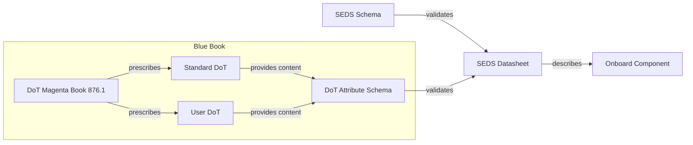
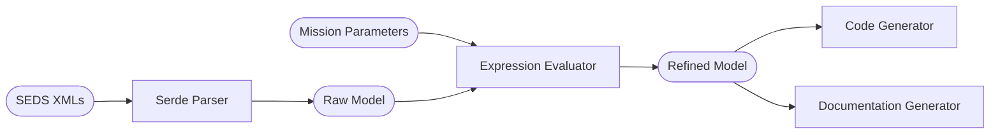

# `seds-rs`: a library for SOIS Electronic Data Sheets

seds-rs is a Rust library designed to read and manipulate CCSDS Blue Book Standard Electronic Data Sheets (SEDS) files. These files, written in a XML format, provide a formal specification for spacecraft components and systems.


## Functionality and Architecture

> A SEDS is intended to be a machine-understandable mechanism for describing onboard
components, as more fully described in the SOIS Green Book.


We implement the CCSDS 876.0-B-1 standard for EDS (Blue Book, April 2019). The standard can be found [here](https://public.ccsds.org/Pubs/876x0b1.pdf). The document defines the XML Specification for SOIS Electronic Data Sheet (SEDS) for
Onboard Devices. The SEDS is for use in electronically describing the data interfaces offered
by flight hardware such as sensors and actuators.

The goal of SEDS is to provide machine-readable descriptions of the data interfaces to faciliate various phases in the life of a space vehicle.


*SEDS Concept Map*

The `seds-rs` crate structures the process of reading and manipulating SEDS files into a series of modeling steps. The following diagram shows the compilation process of `seds-rs`:

*Compilation Process of `seds-rs`*

* **Raw Models:** Parse SEDS files into a high-level, Rust-friendly model. This model is close to the XML structure of the SEDS file. At this level, expressions are represented as strings, and type references are not yet resolved.
* **Refined Models:** After parsing, a SEDS file can be "resolved" into a more detailed model. This involves evaluating expressions, replacing type references with their actual types, and other refinements based on the specific SEDS format and requirements.

## Roadmap

* **Code Generation:** The refined models can serve as input to code generators, allowing automatic creation of software components based on SEDS specifications. Further, we aim to provide a *complete and correct* code generator from SEDS to the Rust programming language (with `no_std` capabilties).
* **Documentation Generation:** Similarly, the refined models can be used to generate detailed technical documentation, including the datatypes, interfaces, and behavior contained within the SEDS file.

## Usage

To add seds-rs as a dependency to your Rust project, add the following to your Cargo.toml:
```toml
[dependencies]
seds-rs = "0.1.0"
```
Alternatively, to build and run the examples of the library directly, clone the seds-rs repository:
```shell
git clone https://gitlab-ext.galois.com/space-bacn/seds-rs.git
cd seds-rs
cargo build
```

## Tests
seds-rs comes with a collection of unit and integration tests to ensure correct parsing and refining of SEDS files:
```shell
cargo test
```


