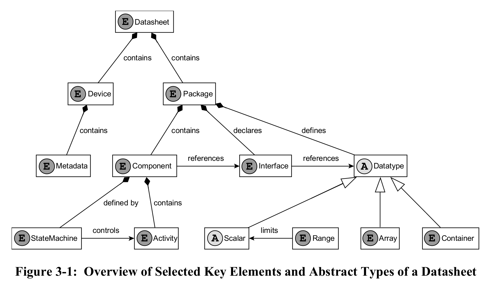

# SEDS Requirements

This document tracks our progress in implementing the SEDS requirements. A checked box indicates that the requirement has been *implemented and tested*. 

## 3.2 ELECTRONIC DATA SHEETS AND THE ASSOCIATED SCHEMA

- [x] **3.2.1** The basic unit of data exchange of SOIS device information is an XML document known as a device datasheet or package file.
- [x] **3.2.2** A device datasheet or package file shall be de defined by a single top-level XML file.
- [x] **3.2.3** Any files referenced by a device datasheet shall be XML package files compliant to the PackageFile element of the SEDS schema.
- [ ] **3.2.4** When a package file is used by a datasheet, XInclude (reference [5]) may be used to incorporate the Package element of that file into a single logical document compliant to the DataSheet element of the SEDS schema.
- [ ] **3.2.5** A package file shall be a single standalone XML file without any use of XInclude.
- [ ] **3.2.6** A SEDS document can make reference to one or more user-defined DoTs. In this case, the actual schema reference from the datasheet will be to a schema which is an extension of the SEDS schema.

## 3.3 SEDS/XML BASIC STRUCTURE

- [x] **3.3.1** The root element of a SEDS document shall be one of the DataSheet and PackageFile elements.
- [x] **3.3.2** The DataSheet element shall contain exactly one Device element.
- [x] **3.3.3** The DataSheet element shall contain one or more Package elements.
- [x] **3.3.4** The PackageFile element shall contain exactly one Package element.
- [x] **3.3.5** The Device and PackageFile elements shall contain zero or one MetaData elements (see 3.4).
- [x] **3.3.6** If any SEDS element is based on the NamedEntityType, the element shall have a name attribute and may have the optional shortDescription attribute and LongDescription child element. Optionally, such an element may carry attributes specified by the standard DoT (reference [1]).
- [x] **3.3.7** The Device element shall be based on the NamedEntityType.

## 3.4 METADATA

- [ ] **3.4.1** A Metadata element shall specify a hierarchical set of categories of constant data values, each of which can be associated with machine-understandable semantics.
- [ ] **3.4.2** A Category element shall specify a categorization or grouping of metadata.
- [ ] **3.4.3** The Category element is based on NamedEntityType (see 3.3.6).
- [ ] **3.4.4** The Category element shall contain one or more child elements, each of which is either a Category element or MetadataValueSet element.
- [ ] **3.4.5** A MetadataValueSet element shall contain one or more child elements, each of which is either a DateValue element, a FloatValue element, an IntegerValue element, or a StringValue element.
- [ ] **3.4.6** The DateValue, FloatValue, IntegerValue, and StringValue elements are all based on FieldType.
- [ ] **3.4.7** DateValue and StringValue elements shall contain a value attribute specifying the value of the metadata as a literal, per table 3-1.
- [ ] **3.4.8** FloatValue and IntegerValue elements may contain a value attribute specifying the value of the metadata as a literal, per table 3-1.
- [ ] **3.4.9** If a FloatValue or IntegerValue element does not contain a value attribute, the body of the element shall specify a MathOperation element, as described in 3.15.32 below, or a Conditional element, as described in 3.15.37 below, to describe how the value should be calculated.

## 3.5 PACKAGES

- [x] **3.5.1** The name of each Package element declared shall be unique within the datasheet.
- [x] **3.5.2** A Package name may be hierarchical, in which case it shall consist of multiple name segments separated by the slash character (‘/’).
- [x] **3.5.3** A package may have an optional shortDescription attribute and an optional LongDescription child element.
- [ ] **3.5.4** A Package element may contain the following optional elements, in the following order: a) DataTypeSet; b) DeclaredInterfaceSet; c) ComponentSet.

## 3.6 DATA TYPES
- [x] **3.6.1** The DataTypeSet element contained in a package or component shall contain one or more of the following elements: ArrayDataType, BinaryDataType, BooleanDataType, ContainerDataType, EnumeratedDataType, FloatDataType, IntegerDataType, StringDataType, and SubRangeDataType.
- [x] **3.6.2** Each child element of a DataTypeSet element is based on the NamedEntityType (see 3.3.7).
- [x] **3.6.3** The name of each child element of a DataTypeSet element shall be unique within the containing package.

## 3.7 SCALAR DATA TYPES

- [x] **3.7.1** Each BooleanDataType, EnumeratedDataType, FloatDataType, IntegerDataType,
StringDataType, or SubRangeDataType element may contain an optional encoding element
of a type corresponding to table 3-1.
- [x] **3.7.2** A FloatDataEncoding or IntegerDataEncoding element may carry a byteOrder attribute specifying a value of a) bigEndian, the default, for values which are to be encoded most significant byte first; or b) littleEndian for values which are to be encoded least significant byte first. NOTE – The littleEndian specification applies only to data types whose size is a multiple of 8 bits.
- [x] **3.7.3** A BooleanDataEncoding element shall carry a sizeInBits attribute which specifies the size, in bits, of the encoded data as a positive integer.
- [x] **3.7.4** A BooleanDataEncoding element may carry a falseValue attribute which specifies the value that corresponds to logical falsehood, with options a) zeroIsFalse (the default); and b) nonZeroIsFalse.
- [x] **3.7.5** An IntegerDataEncoding element shall carry an encoding attribute which has a value of a) unsigned, for an unsigned value; b) signMagnitude, for an encoding with a separate sign bit (the most significant bit is the sign bit, with 1 indicating negative); c) twosComplement, for twos complement; d) onesComplement, for ones complement; e) BCD, for a natural unsigned binary coded decimal, where each byte is a decimal digit encoded as binary; or f) packedBCD, where each byte contains two decimal digits encoded as binary, followed by an optional sign nibble. A negative sign is 1011 or 1101; a positive sign is 1010, 1100, 1110, 1111, or omitted.
- [x] **3.7.6** An IntegerDataEncoding element shall carry a sizeInBits attribute which specifies the size, in bits, of the encoded data as a positive integer.
- [x] **3.7.7** The size in bits of a BCD encoding shall be a multiple of 8. The size in bits of a packedBCD shall be a multiple of 4. The size in bits of both forms of binary coded decimals is a fixed value, so all high-order digits that are zero shall be present to fill the fixed size in bits.
- [x] **3.7.8** A FloatDataEncoding element shall carry an encodingAndPrecision attribute which has a value of either a) IEEE754_2008_single; b) IEEE754_2008_double; c) IEEE754_2008_quad; d) MILSTD_1750A_simple; or e) MILSTD_1750A_extended.  NOTE – These represent the supported sizes of IEEE (reference [6]) and MIL-STD1750A (reference [7]).
- [x] **3.7.9** A FloatDataEncoding element shall carry a sizeInBits attribute which specifies the size, in bits, of the encoded data as a positive integer.
- [x] **3.7.10** A StringDataType shall carry a length attribute which defines the maximum possible length of the string, in bytes.
- [x] **3.7.11** A StringDataType may carry a fixedLength attribute which, if ‘false’, indicates that the string can be shorter than the value specified by the length attribute.  NOTE – Specification of fixedLength="false" indicates a data type that occupies a variable amount of memory. When such a data type is an entry in a container, then the container is of variable length. (See 4.8 for details about string lengths.)
- [x] **3.7.12** A StringDataEncoding element may carry an encoding attribute which has a value of either a) UTF-8, specifying Unicode UTF-8 encoding (reference [8]); or b) ASCII, the default, specifying US ASCII encoding (reference [9]).
- [x] **3.7.13** The optional terminationCharacter attribute of a StringDataEncoding element shall specify the termination character for the string.  
- [x] **3.7.14** An EnumeratedDataType shall contain an EnumerationList element, consisting of a list of one or more Enumeration elements.
- [x] **3.7.15** Each Enumeration element shall have required label and value attributes, indicating the integer value corresponding to a given label string.
- [ ] **3.7.16** An Enumeration element may carry attributes provided by the standard DoT (reference [1]).

## 3.8 RANGES

- [ ] **3.8.1** Each EnumeratedDataType, FloatDataType, IntegerDataType, or SubRangeDataType element shall contain a single Range element of a type corresponding to table 3-1.
- [ ] **3.8.2** A SubRangeDataType element shall contain a baseType attribute, referring to the numeric or enumerated scalar type which defines all properties other than range.
- [ ] **3.8.3** A PrecisionRange element shall be either SINGLE, DOUBLE, or QUAD, representing the full supported representation range of the corresponding IEEE754 floating point data encodings.
- [ ] **3.8.4** A MinMaxRange element shall have an attribute rangeType, one of the options listed in table 3-2.
- [ ] **3.8.5** A MinMaxRange element may have attributes min and max, whose presence and values shall be consistent with table 3-2.
- [ ] **3.8.6** An EnumeratedRange element shall have a list of Label child elements, with values that shall be enumeration labels of the corresponding EnumeratedDataType.

## 3.9 ARRAYS

- [ ] **3.9.1** An ArrayDataType element shall contain a dataTypeRef attribute, referring to the type of the elements within the array.
- [ ] **3.9.2** An ArrayDataType element shall contain a DimensionList element with one or more Dimension child elements.
- [ ] **3.9.3** A Dimension element determines the length of the array dimension, in elements, and shall either have attribute size, directly indicating the maximum length, or attribute indexTypeRef, indicating the integer or enumerated data type to be used to index the array.  The type referenced by an indexTypeRef attribute has maximum and minimum legal values, from which the size of the array can be inferred. When the size attribute is used, the index is zero-based; when the indexTypeRef is used, the index of the first element of the array is the minimum legal value of the index type.
- [ ] **3.9.4** An array having multiple Dimension elements is equivalent to an array with only the first Dimension element and a dataTypeRef naming an array type with the original dataTypeRef and all remaining Dimension elements.

## 3.10 CONTAINERS

- [x] **3.10.1** A ContainerDataType element may carry an optional abstract attribute which, if set to ‘true’, indicates that the container is not to be used directly, only referenced as the base type of other containers.
- [x] **3.10.2** A ContainerDataType element may carry an optional baseType attribute which indicates that the container is a constrained extension of another.
- [x] **3.10.3** A ContainerDataType element shall include zero or one ConstraintSet element and zero or one EntryList element.
- [x] **3.10.4** An abstract ContainerDataType element may include zero or one TrailerEntryList element.
- [x] **3.10.5** The ConstraintSet element of a ContainerDataType element shall specify the criteria that apply to the entries of the container type that is the base type of this container, in order for the type to be valid.
- [ ] **3.10.6** The ConstraintSet element of a ContainerDataType element shall contain one or more child elements, which can be one of a RangeConstraint, a TypeConstraint, or a ValueConstraint.
- [ ] **3.10.7** Each child entry of a ConstraintSet shall have an attribute entry, which names the entry that the constraint applies to. This entry shall exist within a base container reachable by a recursive chain of base container references from the current container.
- [ ] **3.10.8** A RangeConstraint element shall carry a child element of any type of range legal for the type of the constrained entry (see table 3-1).
- [ ] **3.10.9** A TypeConstraint element shall have an attribute type, which shall reference a numeric type which has a range included in the type of the constrained entry.
- [ ] **3.10.10** A ValueConstraint element shall have an attribute value, which shall contain a literal value of a type corresponding to the type of the constrained entry.
- [ ] **3.10.11** The EntryList and TrailerEntryList elements of a ContainerDataType element shall contain one or more Entry, FixedValueEntry, PaddingEntry, ListEntry, LengthEntry, and ErrorControlEntry child elements.
- [ ] **3.10.12** The first entry in an EntryList is located at a bit offset immediately following the last entry of the EntryList of any base container, or offset 0 if no such container exists.
- [x] **3.10.13** For an abstract packet, the first entry in a TrailerEntryList is located at a bit offset immediately following all entries of the derived container.
- [x] **3.10.14** Each other entry in an EntryList or TrailerEntryList is located at a bit offset immediately following the previous entry.
- [x] **3.10.15** Each Entry, FixedValueEntry, ListEntry, LengthEntry, and ErrorControlEntry element shall have the attributes and child elements associated with an external field (see 3.11).
- [x] **3.10.16** Each Entry, FixedValueEntry, ListEntry, LengthEntry, and ErrorControlEntry element within a container shall have a name that is unique within that container, plus all containers recursively referenced by its baseType attribute.
- [x] **3.10.17** A FixedValueEntry entry shall have a fixedValue attribute which specifies the value to which the container entry should be fixed.
- [x] **3.10.18** If the fixedValue attribute is used to specify the value for an entry; the value shall be a literal whose type matches the type of the entry according to table 3-1.
- [x] **3.10.19** A PaddingEntry element within a container shall have an attribute sizeInBits, which is used to specify the position of successive fields.
- [x] **3.10.20** A ListEntry element within a container shall specify an attribute listLengthField which contains the name of another element of the same container whose value will be used to determine the number of times this entry should be repeated.
- [x] **3.10.21** A LengthEntry element within a container shall specify an entry whose value is constrained, or derived, based on the length of the container in which it is present.
- [ ] **3.10.22** If a LengthEntry element has a calibration (see 3.11.7), that calibration shall be used to map between the length in bytes of the container and the value of the entry, according to the formula: container length in bytes = calibration(entry raw value).
- [ ] **3.10.23** Any calibration specified for a LengthEntry shall be reversible, that is, a linear polynomial, or spline, with all points of degree 1.
- [x] **3.10.24** An ErrorControlEntry element within a container shall specify an entry whose value is constrained, or derived, based on the contents of the container in which it is present.  In addition to a subset of the attributes and elements supported for a regular container entry, it has the mandatory attribute type, which is one of the values specified in the DoT for errorControlType as illustrated in table 3-3.

## Elements

## Core Flight System Modules

* `./modules/core_api/eds/base_types.xml`
  * *Standard type definitions for Core Flight System*
  * standard types, plus a definition of a pointer (MemReference)
  * referenced in many other packages (`BASE_TYPES`)
  * basically identical to `./modules/core_private/eds/base_types.xml` base types

* `./modules/core_api/eds/config.xml`
  * contains packages for various services config
  * it is not a SED itself (no schema constraints)
  * * basically identical to `./modules/core_private/eds/config.xml` config

* `./modules/resourceid/eds/cfe_resourceid.xml`
  * a dummy XML

* `./modules/core_api/eds/ccsds_spacepacket.xml`
  * *CCSDS Space Packet Protocol definitions*
  * almost conforms to the Space Packet specs
  * includes some *newer* (Pink book version?) Space Packet features (v2 header)

* `./modules/sb/eds/cfe_sb.xml`
  * *NASA Core Flight System Software Bus*
  * A large number or command message definitions (`<DataTypeSet>`)
  * defines *Interfaces* (`<DeclaredInterfaceSet>`)!
  * defines a set of components (`<ComponentSet>`), which provide or require interfaces

* `./modules/es/eds/cfe_es.xml`
  * *NASA Core Flight System Executive Services*
  * Application Message definitions (`<DataTypeSet>`)
  * defines a component (`<Component>`), with required interfaces
  * references `cfe_sb.xml`

* `./modules/core_api/eds/cfe_fs.xml`
  * *NASA Core Flight System File Services*
  * defines application messages for *File Services*
  * identical with `./modules/fs/eds/cfe_fs.xml`

* `./modules/evs/eds/cfe_evs.xml`
  * *NASA Core Flight System Event Services*
  * a large file, defines application messages (Commands and Telemetry) for *Event Services*
  * defines a component (`<Component>`), with required interfaces

* `./modules/time/eds/cfe_time.xml`
  * *NASA Core Flight System Time Services*
  * defines application messages for *Time Services*
  * defines a component (`<Component>`), with required interfaces

* `./modules/tbl/eds/cfe_tbl.xml`
  * *NASA Core Flight System Table Services*
  * defines application messages for *Table Services*
  * defines a component (`<Component>`), with required interfaces

* `./modules/cfe_testcase/eds/cfe_testcase.xml`
  * *CFE Functional Test (FT) Application Package*
  * *data types* and *components* for a functional test
  * rather minimal

